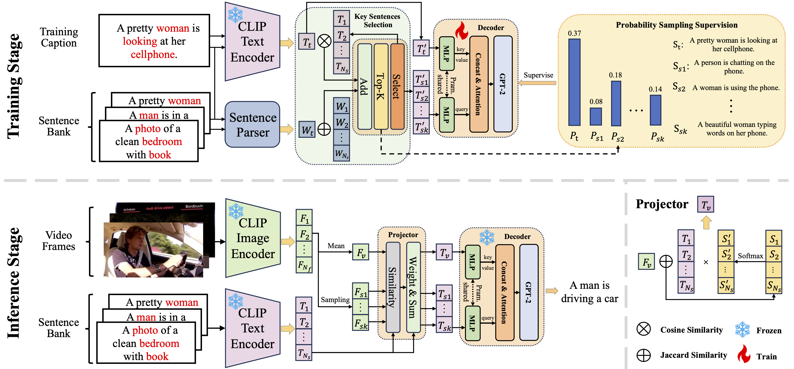

## GCap: Decoding Semantic Group For Zero-shot Video Captioning

[](https://www.python.org/)  [](https://pytorch.org/) [](https://github.com/huggingface/transformers)

This code is the official PyTorch implementation of the paper: GCap: Decoding Semantic Group For Zero-shot Video Captioning

## Introduction

**GCap**, a method tailored for the zero-shot video captioning task, which leverages a **Group Decoding (GD)** strategy. GD enables training and inference based on semantic groups, allowing the model to fully exploit multi-frame information. Additionally, we introduce a **Key Sentences Selection (KSS)** module and a **Probability Sampling Supervision (PSS)** strategy, encouraging the model to acquire more diverse linguistic knowledge from the sentences.


<div align="center">

</div>

## Quickstart

> [!IMPORTANT]
> We conduct experiment on Python 3.13, PyTorch 2.6.0, Transformers 4.48.2, and CUDA 12.0+
1. Requirements

We use conda to control Python virtual environment. Install the dependencies with the following command:

```bash
conda create -n GCap python=3.13 # if using conda to control virtual environment
pip install -r requirements.txt

pip install ftfy regex tqdm # to install openai-clip
pip install git+https://github.com/openai/CLIP.git
```

1. Data preparation

Download the dataset from the URL provided in the paper. For [MSR-VTT](https://www.kaggle.com/datasets/vishnutheepb/msrvtt?resource=download), [MSVD](https://www.cs.utexas.edu/users/ml/clamp/videoDescription/), and [VATEX](https://eric-xw.github.io/vatex-website/about.html). Place the downloaded data under the folder `./data/origin`.

```bash
cd scripts

bash data_msvd.sh
bash data_msrvtt.sh
bash data_vatex.sh
```

The processed data are saved to `./data/extract/`

3. Train and evaluate model

- To see the model structure of GCap, [click here](./model/modeling.py).
- The configuration of GCap is [here](./model/configuration_model.py)

Implement the dataset name (msvd, msrvtt, vatex) that you want to train in Line 24 "export DATASET_NAME="name"". 

Run the following command to start training process: 
```bash
bash train.sh
```

> [!NOTE]
> 1. Some extra packages of the nltk toolkit may need to be download manually. Please follow the instructions of the error information if reported.
> 2. We use a 4-D casual mask for the language model which is not compatible with the code in transformers. Please comment the Line 825 "attention_mask = attention_mask.view(batch_size, -1) if attention_mask is not None else None" in `transformers/models/gpt2/modeling_gpt2.py` (if reporting an error during training)
> 3. We use Wandb to trace the training process. If you wish to use other logging tools, modify Line 72 "--report_to" in scripts/train.sh to use other tookits.

Download pycocoevalcap toolkit and place it under `eval/pycocoevalcap`, To evaluate the checkpoint, run:

```bash
python evaluate_caption.py \
    --checkpoint "path_to_checkpoint" \
    --dataset_name "dataset name" \
    --caption_from "dataset name"
```

## Results
The evaluation scores and generated captions are placed in `results`.